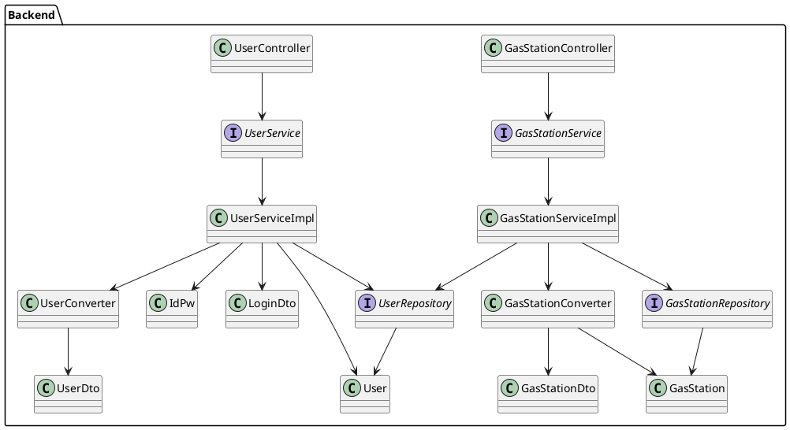

# Integration and API Test Documentation

Authors: Group  21

Date: 25/05/2020

Version: 2

# Contents

- [Dependency graph](#dependency graph)

- [Integration approach](#integration)

- [Tests](#tests)

- [Scenarios](#scenarios)

- [Coverage of scenarios and FR](#scenario-coverage)
- [Coverage of non-functional requirements](#nfr-coverage)

# Dependency graph 

     
# Integration approach

Top-down technique is implemented in integration testing approach to simulate the behaviour of the lower-level modules that are not yet integrated. 

In step 1 classes GasStationServiceTestMock and UserServiceTestMock have been developed that contain stubs in order to test the GasStationServiceImpl and UserServiceImpl classes.

In step 2 UserConverterTest and GasStationConverterTest are the classes used to test the converters. Furthermore, the classes UserRepositoryTest and GasStationRepositoryTest have been developed to test the repository package.

Finally, in step n API GasStationServiceTest and UserServiceTest are the classes that test the service package without mockito.

#  Tests

   <define below a table for each integration step. For each integration step report the group of classes under test, and the names of
     JUnit test cases applied to them>

## Step 1
| Classes  | JUnit test cases |
|--|--|
|GasStationServiceImpl|src.test.java.it.polito.ezgas.GasStationServiceTestMock|
|UserServiceImpl|src.test.java.it.polito.ezgas.UserServiceTestMock|

## Step 2
| Classes  | JUnit test cases |
|--|--|
|GasStationConverter|src.test.java.it.polito.ezgas.GasStationConverterTest|
|UserConverter|src.test.java.it.polito.ezgas.UserConverterTest|
|GasStationRepository|src.test.java.it.polito.ezgas.GasStationRepositoryTest|
|UserConverter|src.test.java.it.polito.ezgas.UserRepositoryTest|

## Step n API Tests

   <The last integration step  should correspond to API testing, or tests applied to all classes implementing the APIs defined in the Service package>

| Classes  | JUnit test cases |
|--|--|
|GasStationServiceImpl|src.test.java.it.polito.ezgas.GasStationServiceTest|
|UserServiceImpl|src.test.java.it.polito.ezgas.UserServiceTest.UserServiceTest|

# Scenarios

<If needed, define here additional scenarios for the application. Scenarios should be named
 referring the UC they detail>

## Scenario UC8
| Scenario |  name |
| ------------- |:-------------:| 
|  Precondition     | user U exists, GasStation G exists, U input the -90<lat<90 and -180<lon<180 , G has Carsharing CSH, H has GasolineType GT, G has -360<Glat<360 , G has -360<Glon<360 |
|  Post condition     |list of GasStation G is found that contain GT and CSH also distance(lat, lon, Glat, Glon) < 1.0   |
| Step#        | Description  |
|  1     |  U opens the Search page |  
|  2     |  U select CSH, GT fill out Lat, lon |
|  3     |  CSH, GT, lat, lon are validated list of GasStation G is shown that contain GT and CSH also distance(lat, lon, Glat, Glon) < 1.0 | 

# Coverage of Scenarios and FR

<Report in the following table the coverage of  scenarios (from official requirements and from above) vs FR. 
Report also for each of the scenarios the (one or more) API JUnit tests that cover it. >

| Scenario ID | Functional Requirements covered | JUnit  Test(s) | 
| ---------- | ------------------------------- | ----------- | 
|UC1 - Create User Account|FR1.1|src.test.java.it.polito.ezgas.UserServiceTest.UserServiceTest.testSaveUser|             
|UC2 - Modify user account| FR1.1 |src.test.java.it.polito.ezgas.UserServiceTest.UserServiceTest.testSaveUser |             
|UC3 - Delete user account| FR1.2 |src.test.java.it.polito.ezgas.UserServiceTest.UserServiceTest.testDeleteUser |            
|UC4 - Create Gas Station| FR3.1 |src.test.java.it.polito.ezgas.GasStationServiceTest.TestSaveGasStation|      
|UC5 - Modify Gas Station information| FR3.1 |src.test.java.it.polito.ezgas.GasStationServiceTest.TestSaveGasStation|      
|UC6 - Delete Gas Station| FR3.2 |src.test.java.it.polito.ezgas.GasStationServiceTest.TestDeleteGasStation |     
|UC7 - Report fuel price for a gas station| FR4.3 |src.test.java.it.polito.ezgas.GasStationServiceTest.TestGetGasStationsWithoutCoordinates|  
|UC8 - Obtain price of fuel for gas stations in a certain geographic area| FR4.3 |src.test.java.it.polito.ezgas.GasStationServiceTest.TestGetGasStationsWithCoordinates| 
|UC9 - Update trust level of price list|FR5 |src.test.java.it.polito.ezgas.GasStationServiceTest| 
|UC10 - Evaluate price| FR5.3 |src.test.java.it.polito.ezgas.UserServiceTest.testIncreaseUserReputation src.test.java.it.polito.ezgas.UserServiceTest.testDecreaseUserReputation|

# Coverage of Non Functional Requirements

<Report in the following table the coverage of the Non Functional Requirements of the application - only those that can be tested with automated testing frameworks.>

### 

| Non Functional Requirement | Test name |
| -------------------------- | --------- |
|                            |           |

