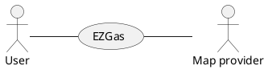
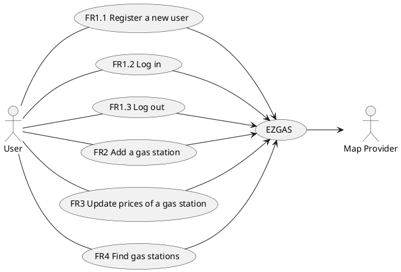
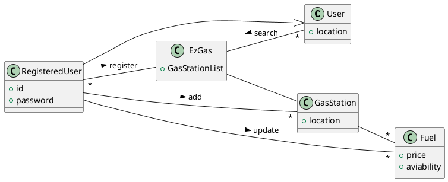
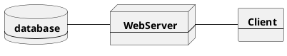
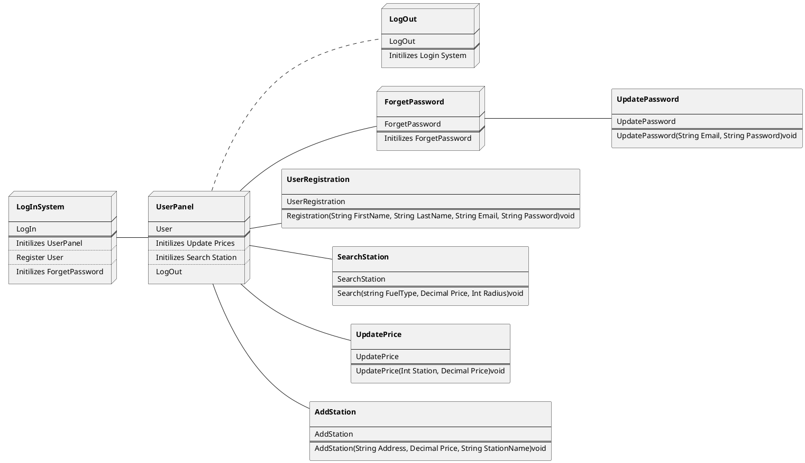

# Requirements Document 

Authors: Mattia Riola

Date: 07/04/2020

Version: 07

Change history

| Version | Changes | 
| ----------------- |:-----------|
| 01 | Creation of the TODO List  |
| 02 | Adding Abstract section  |
| 03 | Fixes: Abstract and TODO; Adding: Stakeholders, Context diagram, Interfaces |
| 04 | Minor Fixes; Adding: Stories and personas, FR, NFR |
| 05 | Minor Fixes; Adding: UC, UC diagram, Scenarios |
| 06 | Glossary |
| 07 | Update TODO List|

# Contents

 - //COMPLETE [Abstract](#abstract)
 - //COMPLETE [Stakeholders](#stakeholders)
 - //COMPLETE [Context Diagram and interfaces](#context-diagram-and-interfaces)
	+ [Context Diagram](#context-diagram)
	+ [Interfaces](#interfaces) 
 - //COMPLETE [Stories and personas](#stories-and-personas)
- //COMPLETE [Functional and non functional requirements](#functional-and-non-functional-requirements)
	+ [Functional Requirements](#functional-requirements)
	+ [Non functional requirements](#non-functional-requirements)
 - //COMPLETE [Use case diagram and use cases](#use-case-diagram-and-use-cases)
	+ [Use case diagram](#use-case-diagram)
	+ [Use cases](#use-cases)
    	+ [Relevant scenarios](#relevant-scenarios)
 - //UPDATE(Delete the remove label, insert fuel type and delate avaiability) [Glossary](#glossary)
 - [System design](#system-design)
 - [Deployment diagram](#deployment-diagram)

# Abstract

Some drivers don't know where the gas stations are and the price of each type of fuel. So a group of university students want to develop a crowdsourcing web application which allows the drivers to find the best gas station when they are running out of gas. The registered users of this app can add a new gas station or update the prices of an existing one. Unregistered users can only view gas stations on the map.

# Stakeholders

| Stakeholder name  | Description | 
| ----------------- |:-----------:|
| Developer | Develops and fixes the software| 
| User	| Uses the web application to find gas stations and classifies them|
| Map provider |The application uses the map to share locations |

# Context Diagram and interfaces

## Context Diagram

## Interfaces
| 	Actor	 |		Logical interface	| Physical interface|
| ------------- |:-------------:| -----:|
| User 		|	GUI 	| 	Screen 	|
| Map API	|	API	|	-	|

# Stories and personas

Mario is 27 years old. He works for an important industry and his job is particularly dynamic, so he and his colleagues often has to travel by car from one city to another. The company refunds to Mario all the money that he spends when traveling among cities, but Mario is particularly careful to save the company’s money and he knows that one of the most important cost when traveling is the fuel. Each time Mario goes to a new city he uses the EZGas application to find the cheapest station close to him. Sometimes happens that in the new city there aren’t any gas station recorded on the application, so Mario decides to go to the closest station and adds it to the EZGas application. This way his colleague Luigi can also find the cheapest gas station in that city.

Ava is a young talented software system analyst who works in a software development company. The company has a geographical structure with branches in different cities. Ava is in charge of analysis for all branches of the company, so she has meetings with customers in different cities most of the meetings scheduled early in the morning. She travels to each city driving the company's car, with a defined fuel budget for travels. Hence it is so important for her to find the nearest stations in order to get to the meetings on time also, the station with the lowest price to satisfy the fuel budget.

Once she woke up late and was rushing to the office which was 2 hours away from her home to attend an important meeting, in the middle of the road, she noticed that the car was run out of fuel or even electricity charge. As she is smart she used to take notes of the locations of stations with their latest fuel prices while traveling to cities. She spent 20 minutes finding the best station considering the distance and budget remainings.

Since Ava could attend the meeting on time and get rewards due to her good job on the analysis, she decided to share her pleasant experience of using her notes with everyone whom the station issue is urgent for their work or daily life. She developed the proposal of EZGas that is the most famous application for drivers nowadays and delivered the proposal to her company.
Moreover, Ava initialized the EZGas data of station locations with the latest prices using her notes. while the application became more famous she added new functions for registered users to update the latest prices of the stations or add new stations. Also, she gathered the data on different kinds of fuel that each station has. 

Nowadays, millions of drivers become the EZGas' users because as soon as they open the application, they are able to see stations around their location with the latest prices and fuel types. The users can fill out the parameters like radius, fuel type, and price to find out the proper station.

Luca is 47 years old and he has a strong passion for cars indeed he's ever looking for an offert or an occasion for a new one, and up to day he owns more than 20 cars in his garage. He does not care at the costs of the garage or the maintainece of the cars because the this is his greatest passion. The main issue for him is given by the different kind of fuel he need for each car, and in particular some cars use the methane that is not ever findable. His policy is that each time he decides to use a car he gets gas only if the fuel is under the half of the tank. Everityime he needs to get gas it uses the EZGas application to find the closest gas station compatible with his gas type, if possible he would like to find also the cheapest but not ever happend.

# Functional and non functional requirements

## Functional Requirements

| ID        | Description  |
| ------------- |:-------------:| 
|  FR1.1   | Register a new user  |
|  FR1.2   | Log in  |
|  FR1.3   | Log out  |
|  FR2     | Add a new gas station  |
|  FR3     | Update prices of a gas station  |
|  FR4.1   | Show the map and the user location |
|  FR4.2   | Filter the gas station |
|  FR4.3   | Sort the gas station |
|  FR4.4   | Show the gas station in the map |
|  FR4.5   | Show the prices of a selected gas station |

## Non Functional Requirements

| ID        | Type (efficiency, reliability, ..)           | Description  | Refers to |
| ------------- |:-------------:| :-----:| -----:|
|  NFR1     | Usability | Application should be used with no training by any drivers | All FR |
|  NFR2     | Performance | All functions should complete in < 0.4 sec  | All FR |
|  NFR3     | Compatibility | Application runs on MS Windows (7 and more recent)  | All FR |
|  NFR4     | Portability | Application (functions and data) should run properly on latest versions of Firefox, Google Chrome browsers | All FR |
|  NFR5    | Reliability | Critical failures can not happen more than once a month for the application | All FR |
|  NFR6    | Availability | Application should be available to users against downtimes not more than 8 seconds  | All FR |
|  NFR7    | Localization | Application should have English language and use Euro currency    | All FR |
|  NFR8    | Maintainability | Application should have 80 percent maintainability for 24 hours   | All FR |

# Use case diagram and use cases

## Use case diagram

### Use case 1, UC1 - Register an user - Related to FR1.1
| Actors Involved        |  |
| ------------- |:-------------:| 
|  Precondition     | User isn't registered |  
|  Post condition     | The user is registered |
|  Nominal Scenario     | The user registers himself in EzGas with his credentials (id and password) |
|  Variants     | If the wanted id is already been taken: repeat asking a new id |

### Use case 2, UC2 - User log in - Related to FR1.2
| Actors Involved        |  |
| ------------- |:-------------:| 
|  Precondition     | User is registered |  
|  Post condition     | The user is logged in  |
|  Nominal Scenario     | The user logs in EzGas with his credentials (id and password) |
|  Variants     | If another account is logged in with the user browser: Ask to log out, If the id or password are wrong: repeat asking the right credential |

### Use case 3, UC3 - User log out - Related to FR1.3
| Actors Involved        |  |
| ------------- |:-------------:| 
|  Precondition     | The user is logged in |  
|  Post condition     | The user is logged out  |
|  Nominal Scenario     | The user logs out from that browser EzGas |
|  Variants     | - |

### Use case 4, UC4 - Add a new gas station - Related to FR2
| Actors Involved        |  |
| ------------- |:-------------:| 
|  Precondition     | The user is logged in, the gas station isn't registered yet |  
|  Post condition     | The gas station is added on EzGas |
|  Nominal Scenario     | The user add the gas station on EzGas |
|  Variants     |  |

### Use case 5, UC5 - Update the prices of an existing gas station - Related to FR3
| Actors Involved        |  |
| ------------- |:-------------:| 
|  Precondition     | The user is logged in, the gas station is registered |  
|  Post condition     | The prices of the gas station are updated |
|  Nominal Scenario     | The user updates the prices of the gas station |
|  Variants     |  |

### Use case 6, UC6 - Show the map and the user location - Related to FR4.1
| Actors Involved        |  |
| ------------- |:-------------:| 
|  Precondition     | The user's location is activated |  
|  Post condition     | The user can see the map and where he/she is located |
|  Nominal Scenario     | The user opens the map to see his/her position |
|  Variants     | If the user's location is off: ask to the user to turn on his/her location |

### Use case 7, UC7 - Select a filter and a sorting method - Related to FR4.2
| Actors Involved        |  |
| ------------- |:-------------:| 
|  Precondition     | - |  
|  Post condition     | The user has selected his/her preferences |
|  Nominal Scenario     | The user filters and sorts the gas stations |
|  Variants     | - |

### Use case 8, UC8 - Show the gas stations on the map - Related to UC7 FR4.3 FR4.4
| Actors Involved        |  |
| ------------- |:-------------:| 
|  Precondition     | The map is shown |  
|  Post condition     | The user can see the gas stations on the map |
|  Nominal Scenario     | The gas stations are shown on the map |
|  Variants     | If there are no gas stations: error message |

### Use case 9, UC9 - Select a gas station - Related to UC8 FR4.5
| Actors Involved        |  |
| ------------- |:-------------:| 
|  Precondition     | At least one gas station is shown on the map |  
|  Post condition     | The user can see the details of a selected gas station |
|  Nominal Scenario     | The user opens the details of a gas station by choosing one   |
|  Variants     | - |

##### Scenario  

### Scenario 1 - User registration

| Scenario 1 | Corrisponds to UC1 |
| ------------- |:-------------:| 
|  Precondition     | The user isn't registered, The wanted id isn't already been taken |
|  Post condition     | The user is registered, the user can log in and log out|
| Step#        | Description  |
|  1     | Start a registration |  
|  2     | Insert id |
|  3     | Insert password |
|  4     | Commit the registration |

### Scenario 2 - Find the gas station

| Scenario 2 | Corrisponds to UC6 UC7 UC8 UC9 |
| ------------- |:-------------:| 
|  Precondition     | The location is activated  |
|  Post condition     | The user find the best gas station |
| Step#        | Description  |
|  1     | Load the map |  
|  2     | The user select the filter and a sorting method (there is a default option) |
|  3     | Load the gas stations that are within the chosen filter |
|  4     | Sort the gas stations  |
|  5     | Select a gas stations  |
|  6     | Show the details of the selected gas stations  |

### Scenario 3 - Add a new gas station

| Scenario 3 | Corrisponds to UC2 UC4 |
| ------------- |:-------------:| 
|  Precondition     | The user is registered |
|  Post condition     | The user updates the informations adding a new gas station |
| Step#        | Description  |
|  1     | If the user is already logged in go to step 7 |  
|  2     | Open the log in |
|  3     | Insert your id |
|  4     | Insert your password |
|  5     | Commit your id and password |
|  6     | If the id and/or the password are wrong go to step 2 and show an error message |
|  7     | Start adding a new station |
|  8     | Insert the address of the gas station |
|  9     | Insert the prices of the gas station |
|  10     | Commit |

### Scenario 4 - Update the informations

| Scenario 4 | Corrisponds to UC2 UC5 |
| ------------- |:-------------:| 
|  Precondition     | The user is registered, a gas station has been selected |
|  Post condition     | The user updates the informations updating the prices of an existing one or removing a closed down one |
| Step#        | Description  |
|  1     | If the user is already logged in go to step 7 |  
|  2     | Open the log in |
|  3     | Insert your id |
|  4     | Insert your password |
|  5     | Commit your id and password |
|  6     | If the id and/or the password are wrong go to step 2 and show an error message |
|  7     | Start updating |
|  8    | Insert the prices of each fuel type |
|  9     | Commit |

### Scenario 5 - Log out

| Scenario 5 | Corrisponds to UC3 |
| ------------- |:-------------:| 
|  Precondition     | The user is logged in |
|  Post condition     | The user is logged out |
| Step#        | Description  |
|  1     |Start a log out|  
|  2     | Commit |

# Glossary

# System Design

# Deployment Diagram 

