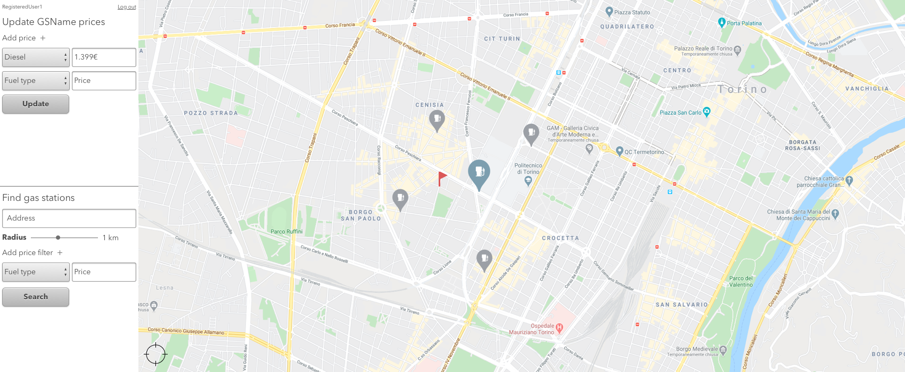

# Graphical User Interface Prototype  

Authors: Group 21

Date: 18/04/20

Version: 01

Change history

| Version | Changes | 
| ----------------- |:-----------|
| 01 | Inital version |

# Contents

 - Abstract 
 - [Register an user, user log in](#register-an-user,-user-log-in)
    + [Variant username taken](#variant-username-taken)
    + [Variant wrong credentials](#variant-wrong-credentials)
    + [Variant user already logged in](#variant-user-already-logged-in)
 - [Add a new gas station](#add-a-new-gas-station)
 - [Update the prices of an existing gas station](#update-the-prices-of-an-existing-gas-station)
 - [Show the map and the user location](#show-the-map-and-the-user-location)
	+ [Variant user location is off](#variant-user-location-is-off) 
 - [Select search filters](#select-search-filters)
 - [Show the gas stations on the map and select a gas station](#show-the-gas-stations-on-the-map-and-select-a-gas-station)
    + [Variant no gas stations found](#variant-no-gas-stations-found)

# Abstract
The following presentation is based on the content of the RequirementsDocument.md. It shows a possible UI for the use cases and/or scenarios.

# Register an user, user log in

## Variant username taken

## Variant wrong credentials

## Variant user already logged in

# Add a new gas station

# Update the prices of an existing gas station

# Show the map and the user location

## Variant user location is off

# Select search filters

# Show the gas stations on the map and select a gas station

## Variant no gas stations found

