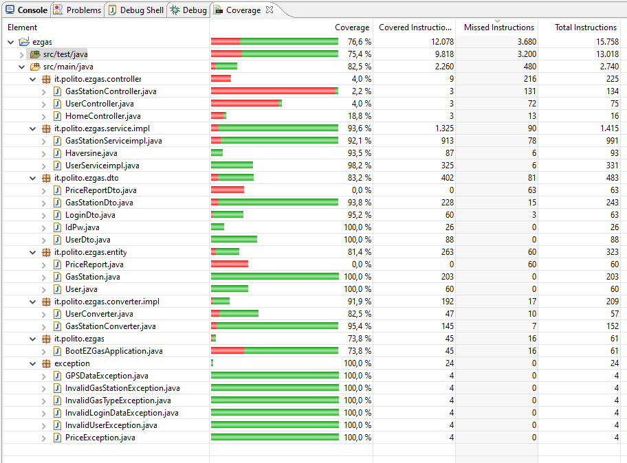

# Unit Testing Documentation

Authors: Group 21

Date: 25/05/2020

Version: 2

# Contents

- [Black Box Unit Tests](#black-box-unit-tests)
- [White Box Unit Tests](#white-box-unit-tests)

# Black Box Unit Tests

    <Define here criteria, predicates and the combination of predicates for each function of each class.
    Define test cases to cover all equivalence classes and boundary conditions.
    In the table, report the description of the black box test case and (traceability) the correspondence with the JUnit test case writing the 
    class and method name that contains the test case>
    <JUnit test classes must be in src/test/java/it/polito/ezgas   You find here, and you can use,  class EZGasApplicationTests.java that is executed before 
    the set up of all Spring components
    >

 ### **Class *User* - method *setUserId()***

**Criteria for method *setUserId()*:**

 - Type of parameter
 - Value of parameter

**Predicates for method *setUserId()*:**

| Criteria | Predicate |
| -------- | --------- |
|Type of parameter        |int  |
|                         |string|
|                         |other|
|Value of parameter       |[minint,-1]|
|                         |[0,maxint]|

**Boundaries**:

| Criteria | Boundary values |
| -------- | --------------- |
| Value of parameter | minint, minint+1, -1, 0, maxint-1, maxint |

**Combination of predicates**:

| Type of parameter | Value of parameter | Valid / Invalid | Description of the test case | JUnit test case |
|-------|-------|-------|-------|-------|
|string|-|Invalid|T1 {setUserId('0E984725-C51C-4BF4-9960-E1C80E27ABA0wrong') -> Error}|-|
|string|-|Invalid|T2 {setUserId("A") -> Error} |-|
|double|-|Invalid|T3 {setUserId(2.1)-> Error}|-|
|int|minint|valid|T4 {setUserId(minint) -> Ok}|-|
||minint+1|valid|T5 {setUserId(minint+1) -> Ok}|-|
||-1|valid|T6 {setUserId(-1) -> Ok}|-|
||0|valid|T7 {setUserId(0) -> Ok}|-|
||10|valid|T8 {setUserId(10) -> Ok}|src.test.java.it.polito.ezgas.UserEntityTest.testUserId|
||maxint|valid|T9 {setUserId(maxint) -> Ok}|-|
||maxint-1|valid|T10 {setUserId(maxint-1) -> Ok}|-|

 ### **Class *User* - method *getUserId()***

**Combination of predicates**:

| Type of parameter | Value of parameter | Valid / Invalid | Description of the test case | JUnit test case |
|-------|-------|-------|-------|-------|
|string|-|Invalid|T1 {setUserId(‘0E984725-C51C-4BF4-9960-E1C80E27ABA0wrong’); -> Error}|-|
|string|-|Invalid|T2 {setUserId("A"); -> Error}|-|
|double|-|Invalid|T3 {setUserId(2.1); -> Error}|-|
|int|minint|valid|T4 {setUserId(minint);   getUserId() -> minint}|-|
||minint+1|valid|T5 {setUserId(minint+1);   getUserId() -> minint+1}|-|
||-1|valid|T6 {setUserId(-1);   getUserId(); -> -1}|-|
||0|valid|T7 {setUserId(0);   getUserId() -> 0}|-|
||10|valid|T8 {setUserId(10);   getUserId() -> 10}|src.test.java.it.polito.ezgas.UserEntityTest.testUserId|
||maxint|valid|T9 {setUserId(maxint);   getUserId() -> maxint}|-|
||maxint-1|valid|T10 {setUserId(maxint-1);   getUserId() -> maxint-1}|-|

The other methods of the class User have been tested in a similar way, passing a correct parameter to the setter method and by retrieving it with the getter.

### **Class *GasStation* - method *setGasStationId()***

**Criteria for method *setGasStationId()*:**

 - Type of parameter
 - Value of parameter

**Predicates for method *setGasStationId()*:**

| Criteria | Predicate |
| -------- | --------- |
|Type of parameter        |int  |
|                         |string|
|                         |other|
|Value of parameter       |[minint,-1]|
|                         |[0,maxint]|

**Boundaries**:

| Criteria | Boundary values |
| -------- | --------------- |
| Value of parameter | minint, minint+1, -1, 0, maxint-1, maxint |

**Combination of predicates**:

| Type of parameter | Value of parameter | Valid / Invalid | Description of the test case | JUnit test case |
|-------|-------|-------|-------|-------|
|string|-|Invalid|T1 {setGasStationId('0E984725-C51C-4BF4-9960-E1C80E27ABA0wrong') -> Error}|-|
|string|-|Invalid|T2 {setGasStationId("A") -> Error} |-|
|double|-|Invalid|T3 {setGasStationId(2.1)-> Error}|-|
|int|minint|valid|T4 {setGasStationId(minint) -> Ok}|-|
||minint+1|valid|T5 {setGasStationId(minint+1) -> Ok}|-|
||-1|valid|T6 {setGasStationId(-1) -> Ok}|-|
||0|valid|T7 {setGasStationId(0) -> Ok}|-|
||10|valid|T8 {setGasStationId(10) -> Ok}|src.test.java.it.polito.ezgas.GasStationEntityTest.testId|
||maxint|valid|T9 {setGasStationId(maxint) -> Ok}|-|
||maxint-1|valid|T10 {setGasStationId(maxint-1) -> Ok}|-|

### **Class *GasStation* - method *getGasStationId()***

**Combination of predicates**:

| Type of parameter | Value of parameter | Valid / Invalid | Description of the test case | JUnit test case |
|-------|-------|-------|-------|-------|
|string|-|Invalid|T1 {setGasStationId(‘0E984725-C51C-4BF4-9960-E1C80E27ABA0wrong’); -> Error}|-|
|string|-|Invalid|T2 {setGasStationId("A"); -> Error}|-|
|double|-|Invalid|T3 {setGasStationId(2.1); -> Error}|-|
|int|minint|valid|T4 {setGasStationId(minint);   getGasStationId() -> minint}|-|
||minint+1|valid|T5 {setGasStationId(minint+1);   getGasStationId() -> minint+1}|-|
||-1|valid|T6 {setGasStationId(-1);   getGasStationId(); -> -1}|-|
||0|valid|T7 {setGasStationId(0);   getGasStationId() -> 0}|-|
||10|valid|T8 {setGasStationId(10);   getGasStationId() -> 10}|src.test.java.it.polito.ezgas.GasStationEntityTest.testId|
||maxint|valid|T9 {setGasStationId(maxint);   getGasStationId() -> maxint}|-|
||maxint-1|valid|T10 {setGasStationId(maxint-1);   getGasStationId() -> maxint-1}|-|

The other methods of the class GasStation have been tested in a similar way, passing a correct parameter to the setter method and by retrieving it with the getter.

### **Class *Haversine* - method *distance()***

note that the computations are based on :
[sismogrammi.com/calcolo-distanze](https://www.sismogrammi.com/calcolo-distanze.php)

**Criteria for method *distance()*:**

 - Type of parameters
 - Value of parameters

**Predicates for method *distance()*:**

| Criteria | Predicate |
| -------- | --------- |
|Type of parameter        |double|
|Value of parameter       |[-90.0,90.0]|
|                         |[-180.0,180.0]|

**Boundaries**:

| Criteria | Boundary values |
| -------- | --------------- |
| Value of parameter | -90.1, -90, -89.9, 89.9, 90, 90.1, -180.1, -180, -179.9, 179.9, 180.0, 180.1|

**Combination of predicates**:

NOTE: the result of the method is returned in meters

| Type of parameter | Value of parameter | Valid / Invalid | Description of the test case | JUnit test case |
|-------|-------|-------|-------|-------|
|string|-|Invalid|T1 {distance(‘0E984725-C51C-4BF4-9960-E1C80E27ABA0wrong’,‘631c400c-b535-48ab-97e6-4e57e7001eff’,‘3794a41e-30af-4858-96d5-637852c57ec8’,‘30b3b77c-8b16-4379-ba82-857ddae9f347’);-> Error}|-|
|string|-|Invalid|T2 {distance("lat1", "lon1", "lat2", "lon2");-> Error}|-|
|double|-|Valid|T3 {distance(45,50,45.1,40.1) -> 13615}|src.test.java.it.polito.ezgas.HaversineTest.testDistanceTest|
||-|Valid|T4 {distance(0,0,90,180) -> 10007543}|src.test.java.it.polito.ezgas.HaversineTest.testDistanceTest|
||-|Valid|T5 {distance(-25,30,-26,35) -> 513947}|src.test.java.it.polito.ezgas.HaversineTest.testDistanceTest|
||-|Valid|T6 {distance(-25.45,-30,-26.03,-35) -> 504910}|src.test.java.it.polito.ezgas.HaversineTest.testDistanceTest|
||-|Invalid|T7 {distance(380,-390,380.02,-391) -> Error}|src.test.java.it.polito.ezgas.HaversineTest.testDistanceTest|
||-|invalid|T8 {distance(-500,800,600,-900) -> Error}|src.test.java.it.polito.ezgas.HaversineTest.testDistanceTest|
||-|Invalid|T9 {distance(-maxdouble,-maxdouble,maxdouble,,maxdouble) -> Error}|src.test.java.it.polito.ezgas.HaversineTest.testDistanceTest|

 ### **Class *UserDto* - method *setUserId()***

**Criteria for method *setUserId()*:**

 - Type of parameter
 - Value of parameter

**Predicates for method *setUserId()*:**

| Criteria | Predicate |
| -------- | --------- |
|Type of parameter        |int  |
|                         |string|
|                         |other|
|Value of parameter       |[minint,-1]|
|                         |[0,maxint]|

**Boundaries**:

| Criteria | Boundary values |
| -------- | --------------- |
| Value of parameter | minint, minint+1, -1, 0, maxint-1, maxint |

**Combination of predicates**:

| Type of parameter | Value of parameter | Valid / Invalid | Description of the test case | JUnit test case |
|-------|-------|-------|-------|-------|
|string|-|Invalid|T1 {setUserId('0E984725-C51C-4BF4-9960-E1C80E27ABA0wrong') -> Error}|-|
|string|-|Invalid|T2 {setUserId("A") -> Error} |-|
|double|-|Invalid|T3 {setUserId(2.1)-> Error}|-|
|int|minint|valid|T4 {setUserId(minint) -> Ok}|-|
||minint+1|valid|T5 {setUserId(minint+1) -> Ok}|-|
||-1|valid|T6 {setUserId(-1) -> Ok}|-|
||0|valid|T7 {setUserId(0) -> Ok}|-|
||10|valid|T8 {setUserId(10) -> Ok}|src.test.java.it.polito.ezgas.UserDtoTest.testUserId|
||maxint|valid|T9 {setUserId(maxint) -> Ok}|-|
||maxint-1|valid|T10 {setUserId(maxint-1) -> Ok}|-|

### **Class *UserDto* - method *getUserId()***

**Combination of predicates**:

| Type of parameter | Value of parameter | Valid / Invalid | Description of the test case | JUnit test case |
|-------|-------|-------|-------|-------|
|string|-|Invalid|T1 {setUserId(‘0E984725-C51C-4BF4-9960-E1C80E27ABA0wrong’); -> Error}|-|
|string|-|Invalid|T2 {setUserId("A"); -> Error}|-|
|double|-|Invalid|T3 {setUserId(2.1); -> Error}|-|
|int|minint|valid|T4 {setUserId(minint);   getUserId() -> minint}|-|
||minint+1|valid|T5 {setUserId(minint+1);   getUserId() -> minint+1}|-|
||-1|valid|T6 {setUserId(-1);   getUserId(); -> -1}|-|
||0|valid|T7 {setUserId(0);   getUserId() -> 0}|-|
||10|valid|T8 {setUserId(10);   getUserId() -> 10}|src.test.java.it.polito.ezgas.UserDtoTest.testUserId|
||maxint|valid|T9 {setUserId(maxint);   getUserId() -> maxint}|-|
||maxint-1|valid|T10 {setUserId(maxint-1);   getUserId() -> maxint-1}|-|

### **Class *GasStationDto* - method *setGasStationId()***

**Criteria for method *setGasStationId()*:**

 - Type of parameter
 - Value of parameter

**Predicates for method *setGasStationId()*:**

| Criteria | Predicate |
| -------- | --------- |
|Type of parameter        |int  |
|                         |string|
|                         |other|
|Value of parameter       |[minint,-1]|
|                         |[0,maxint]|

**Boundaries**:

| Criteria | Boundary values |
| -------- | --------------- |
| Value of parameter | minint, minint+1, -1, 0, maxint-1, maxint |

**Combination of predicates**:

| Type of parameter | Value of parameter | Valid / Invalid | Description of the test case | JUnit test case |
|-------|-------|-------|-------|-------|
|string|-|Invalid|T1 {setGasStationId('0E984725-C51C-4BF4-9960-E1C80E27ABA0wrong') -> Error}|-|
|string|-|Invalid|T2 {setGasStationId("A") -> Error} |-|
|double|-|Invalid|T3 {setGasStationId(2.1)-> Error}|-|
|int|minint|valid|T4 {setGasStationId(minint) -> Ok}|-|
||minint+1|valid|T5 {setGasStationId(minint+1) -> Ok}|-|
||-1|valid|T6 {setGasStationId(-1) -> Ok}|-|
||0|valid|T7 {setGasStationId(0) -> Ok}|-|
||10|valid|T8 {setGasStationId(10) -> Ok}|src.test.java.it.polito.ezgas.GasStationDtoTest.testId|
||maxint|valid|T9 {setGasStationId(maxint) -> Ok}|-|
||maxint-1|valid|T10 {setGasStationId(maxint-1) -> Ok}|-|

### **Class *GasStationDto* - method *getGasStationId()***

**Combination of predicates**:

| Type of parameter | Value of parameter | Valid / Invalid | Description of the test case | JUnit test case |
|-------|-------|-------|-------|-------|
|string|-|Invalid|T1 {setGasStationId(‘0E984725-C51C-4BF4-9960-E1C80E27ABA0wrong’); -> Error}|-|
|string|-|Invalid|T2 {setGasStationId("A"); -> Error}|-|
|double|-|Invalid|T3 {setGasStationId(2.1); -> Error}|-|
|int|minint|valid|T4 {setGasStationId(minint);   getGasStationId() -> minint}|-|
||minint+1|valid|T5 {setGasStationId(minint+1);   getGasStationId() -> minint+1}|-|
||-1|valid|T6 {setGasStationId(-1);   getGasStationId(); -> -1}|-|
||0|valid|T7 {setGasStationId(0);   getGasStationId() -> 0}|-|
||10|valid|T8 {setGasStationId(10);   getGasStationId() -> 10}|src.test.java.it.polito.ezgas.GasStationDtoTest.testId|
||maxint|valid|T9 {setGasStationId(maxint);   getGasStationId() -> maxint}|-|
||maxint-1|valid|T10 {setGasStationId(maxint-1);   getGasStationId() -> maxint-1}|-|

# White Box Unit Tests

### Test cases definition
    
    <JUnit test classes must be in src/test/java/it/polito/ezgas>
    <Report here all the created JUnit test cases, and the units/classes under test >
    <For traceability write the class and method name that contains the test case>

| Unit name | JUnit test case |
|--|--|
|||
|||
||||

### Code coverage report

    <Add here the screenshot report of the statement and branch coverage obtained using
    the Eclemma tool. >

### Loop coverage analysis

    <Identify significant loops in the units and reports the test cases
    developed to cover zero, one or multiple iterations >

|Unit name | Loop rows | Number of iterations | JUnit test case |
|---|---|---|---|
|||||
|||||
||||||

**Combination of predicates**:

| Criteria 1 | Criteria 2 | ... | Valid / Invalid | Description of the test case | JUnit test case |
|-------|-------|-------|-------|-------|-------|
|||||||
|||||||
|||||||
|||||||
|||||||

